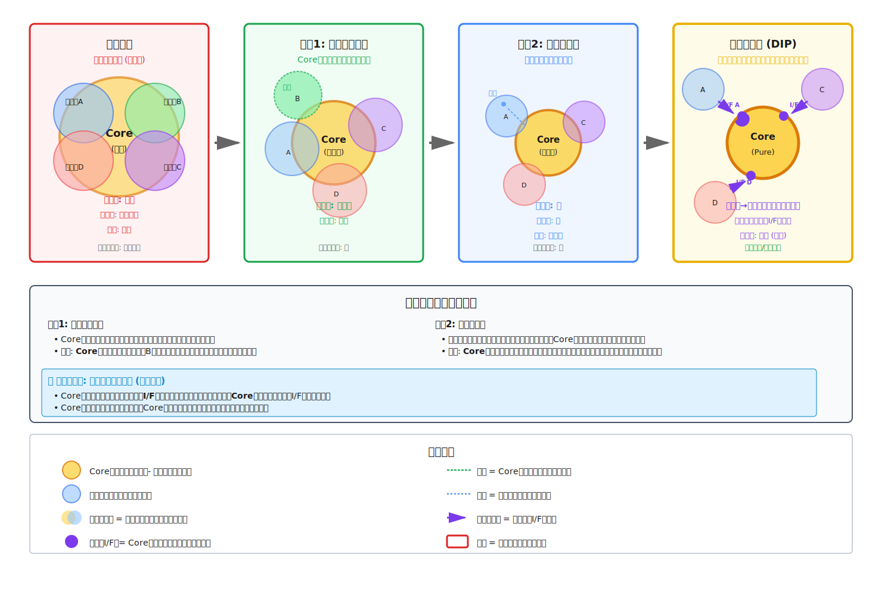
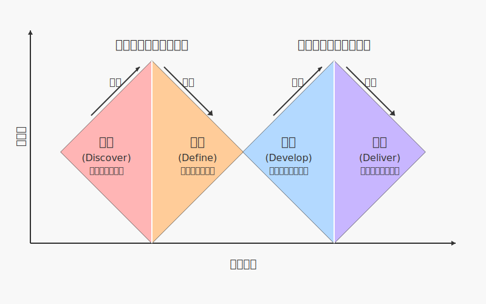

---
# You can also start simply with 'default'
theme: seriph
# random image from a curated Unsplash collection by Anthony
# like them? see https://unsplash.com/collections/94734566/slidev
background: https://cover.sli.dev
# some information about your slides (markdown enabled)
title: アーキテクチャレベルで依存性を逆転させたら最高だった話
info: |
  PHPカンファレンス福岡2025
  https://phpcon.fukuoka.jp/2025/
# apply unocss classes to the current slide
class: text-center
# https://sli.dev/features/drawing
drawings:
  persist: false
# slide transition: https://sli.dev/guide/animations.html#slide-transitions
transition: slide-left
seoMeta:
  ogImage: auto
# duration of the presentation, default is '30min'
duration: 30min
# timer mode, can be 'countdown' or 'stopwatch', default is 'stopwatch'
timer: stopwatch
# enable MDC Syntax: https://sli.dev/features/mdc
mdc: true
addons:
  - '@katzumi/slidev-addon-qrcode'
  - '@katzumi/slidev-addon-ogp-image'
  - slidev-addon-components
  - slidev-addon-rabbit
---

# アーキテクチャレベルで依存性を逆転させたら最高だった話

PHP カンファレンス福岡 2025 November 8, 2025.  
v0.0.1  
@katzumi(かつみ)

  Press Space for next page <carbon:arrow-right />

  <button @click="$slidev.nav.openInEditor" title="Open in Editor" class="slidev-icon-btn">
    <carbon:edit />
  </button>
  <a href="https://github.com/k2tzumi/domain-distillation" target="_blank" class="slidev-icon-btn">
    <carbon:logo-github />
  </a>

<!--
The last comment block of each slide will be treated as slide notes. It will be visible and editable in Presenter Mode along with the slide. [Read more in the docs](https://sli.dev/guide/syntax.html#notes)
-->

---
transition: fade-out
layout: two-cols-header
---

# <carbon-user-avatar /> 自己紹介

katzumi（かつみ）と申します。

「障害のない社会をつくる」をビジョンとする「LITALICO（りたりこ）」に所属しています

以下のアカウントで活動しています。

::left::

  
<simple-icons-x /> <a href="https://twitter.com/katzchum">katzchum</a>
  
<QRCode :width="180" :height="180" value="https://twitter.com/katzchum" color="4329B9" image="Logo_of_X.svg" />

::right::

<logos-github-octocat /> [k2tzumi](https://github.com/k2tzumi)  
<simple-icons-zenn /> [katzumi](https://zenn.dev/katzumi)  

 

<!--
はじめましてkatzumiと申します  
LITALICOという会社で、社内ではSlack Bot Officerとして活動しています。  
好きなラーメンは油そばとベジポタラーメンです
-->

---
layout: two-cols-header
transition: fade-out
---

# <carbon-information /> お願い 🙏

写真撮影、SNS での実況について

登壇者の励みになるので是非ともご意見やご感想など、フィードバック頂けると助かります mm  
スライドの内容は、すでに以下の場所で公開されていますので、ぜひお手元でご覧ください  

* [forteeのプロポーザルページ](https://fortee.jp/phpcon-fukuoka-2025/proposal/6675eb22-13f1-4b11-8093-1b522345c2eb)
* または <fa6-brands-square-x-twitter /> の投稿

::left::

<Transform :scale="2.5">
　　　🙆‍♀📷<ph-projector-screen-chart-light /> 
　　　🙅‍♂📹💸 
　　　🙅📸👨‍👦‍👦 
</Transform>

::right::

 
<Transform :scale="2">
<fa6-brands-square-x-twitter />
</Transform>
 
<a href="https://x.com/search?q=%23phpconfuk%20%23hall_d&f=live">#phpconfuk #hall_d</a>

<!--
いっぱい呟いてください
-->

---

# 本日のお話すること
とある複雑なドメインを扱うシステムの物語です。集大成的なお話をします

* レセプト業務という複雑なドメインで、2 度の大規模法改正に立ち向かった実体験です。
* ２度のリアーキテクチャを経て Rezept as a Service を立ち上げた話（ドメイン蒸留）
* どうやってサービスを実現し、どういうメリットがあったのか？（戦術）
* 何故 Rezept as a Service が必要だと判断したのか？（戦略）

<v-click>

元ネタは昨年のアドベントカレンダーです。

<Transform :scale="0.5">

</Transform>

</v-click>

---
transition: fade-out
---

# レセプト業務の複雑さを視覚化

圧巻の 1.5K 頁オーバー。3 年に 1 回、大改訂（大改定）があります

---
layout: image-right
image: /ISBN-978-4824300867.png
transition: slide-up
---

# 厚い本が更に厚くなる
手に取って持ち運べるような、携帯に便利な手引書感がまったくない、改訂版がこちら

なぜか３部作にｗ  
全体のページ数が 2k オーバーに  
モデルチェンジで x1.3 増ページはなかなか、、

---

# 「レセプト業務」って何？
医療で言うところの診療報酬明細書（医療点数が書かれているアレ）を作成するお仕事です

<Transform :scale="1.2">

* **🧾 概要**  
障害福祉サービスや介護事業所で提供されたサービスの費用を計算し、  
市町村や国保連などの支払い機関に請求する業務です。  
利用者は費用の一部（利用者負担額）を支払い、  
残りの公費・保険負担分を正確に計算し請求するのが重要な役割です。  
計算の基となるのは、サービス内容に応じて定められた「単位数」です。  
これは「単位数表」で定義されています。  

* **🗂️ 計算ルールをまとめたもの=単位数表を図式化したもの＝算定構造**  
単位数を計算するプロセスを「算定」と呼びます。  
算定には国が定めた非常に細かくて複雑なルールがたくさんあります。  
これらの算定ルール及び、単位数表の関係を図式化したものを「算定構造」と呼びます。  
この算定構造は表形式でまとめられています。

</Transform>

---

# 宣伝

算定構造の作り方のエッセンスを紹介しました

<OgpImage url="https://www.docswell.com/s/katzumi/KLQL3Q-decision-table-implementation-tips" />

---

# 法改正の難しさ

大規模な法改正（報酬改定）が 3 年毎にあります

- 情報公開から実装完了まで約 3 ヶ月
- 算定ルール（報酬体系）が大幅に見直しされる
- 年々複雑化  
算定パターン数が 3 倍になるケースもある
- 過去 5 年間は再請求の為にロジックを残さないといけない
- 改正内容の影響範囲が広範囲にわたる  
改正は請求（報酬単価の見直し）だけでなく、支援内容・実績記録すべてを変える  
→ システム全体が連鎖的に影響を受ける

---

# レセプト業務のプロセス特有の構造上の問題
データの流れ = 依存の方向となる

---
layout: two-cols-header
---

# レセプトの開発の辛み
この矛盾にお気づき頂けますでしょうか。。

レセプト業務は:
- ビジネスの生命線
- 最も複雑でミスの影響が大きい
- パターン数が多く、テストに時間がかかる
- 最も安定させるべき

なのに、「下流」に位置している。

::left::

上流（実績データ）:
- 各プロダクトが使いやすさを追求
- 仕様確定に時間がかかる
- 変更が頻繁

::right::

下流（レセプト）:
- 上流の影響を直接受ける  
算定ルールが実績データと密結合となる
- 最も不安定な位置に

---

# 法改正の難しさ（再掲）

大規模な法改正（報酬改定）が 3 年毎にあります

- 情報公開から実装完了まで約 3 ヶ月
- 算定ルール（報酬体系）が大幅に見直しされる
- 年々複雑化  
算定パターン数が 3 倍になるケースもある
- 過去 5 年間は再請求の為にロジックを残さないといけない
- 改正内容の影響範囲が広範囲にわたる  
改正は請求（報酬単価の見直し）だけでなく、支援内容・実績記録すべてを変える  
→ システム全体が連鎖的に影響を受ける

<v-clicks>

改修ボリューム的に1チームで完結しない。関心事も様々で混在し絡み合っている

</v-clicks>
<v-clicks at=2>

実績データの仕様Fixをまってからレセプト機能を実装していたら、間に合わなくなる！

</v-clicks>

---
layout: center
class: text-center
---

# 😰 どうすれば。。

---
layout: center
class: text-center
---

# 2020年から4年半の取り組みを紹介

---
layout: center
class: text-center
---

# 先にまとめ
2 つの Key Success Factor

<v-clicks>

1. 関心事の分離
2. 依存性逆転

</v-clicks>

---

# 関心事の分離
責務の分離、Separation Of Concerns／SOC

* 責務を十分小さくする  
修正した場合に影響範囲を限定的にする
* 認知できるサイズとなるように分離する  
* 修正する理由は1つにする 

---
layout: two-cols-header
---

# どういう関心事を分離していったのか？
まずは 2 つの関心事を分離した

* 法改正で旧制度と新制度のロジックが混ざらないようにした  
同一の関心事を時系列で分断させ別の関心事として扱う
* 法改正の影響がない周辺の関心事を外に出した  
時系列で変化をしない処理（請求状態や帳票管理等）を独立させた

<v-click at="1">

2021年度法改正での取り組み

</v-click>

::left::

<v-click at="1">

<OgpImage url="https://zenn.dev/litalico/articles/confronting-law-amends-with-microservices" />

</v-click>

::right::

<v-click at="1">

<OgpImage url="https://zenn.dev/litalico/articles/confronting-law-amends-with-microservices" />

</v-click>

---

# 関心事を分離によるメリット
どういう効果があったのか？

* 法改正ロジックが追加しやすくなった  
  * 旧制度のロジックに手を入れずに新制度を追加できるようになった  
  旧制度を知らなくても新制度に集中して実装できる【変更容易性、理解容易性】  
  →　トータルの複雑さは同じだが、一度に扱う複雑さ（認知サイズ）が半分に
  * 法改正時に新制度のみをテストすれば良くなった  
  旧制度のロジックの修正を行わないので、新規ロジックのみをテストすれば良い【不変性の確保、テスト容易性】
  * 逆に不要になったロジックを削除しやすくなった    
  青天井に複雑にならないようになった【保守性の向上】
* モジュールとして独立させやすくなった[^1]  
責務が明確になって、サービスとして切り出しやすくなった

[^1]: あくまで印象です。実際に切り出すには、まだまだ足りない部分が多かったです

---
layout: center
class: text-center
---

# まだ足りない
外部環境（ビジネス拡大）の変化もあり、もっと複雑で状況的に厳しくなった

### 改善点

法改正のロジックを追加しやすくなった  
テスト範囲を限定的にできた

### 外部環境の変化

請求を行うサービスが増え、関心事や関係者が分散した  
対応領域の重複や拡大があり法改正の難易度が急上昇

<v-clicks>

個別最適していっただけでは、法改正を乗り切れなくなる   
ビジネスリスクも増加

</v-clicks>

---
layout: center
class: text-center
---

# 依存性逆転という解決
タイトル回収

依存性逆転の原則（Dependency Inversion Principle）を  
アーキテクチャレベルで適用する

---
layout: center
class: text-center
---

# Rezept as a Service
レセプト業務を BaaS (Backend as a Service) 化

---
layout: two-cols-header
---

# 発想の転換 - 依存性逆転
重要な気づき

データの流れは変えられない。<v-click>でも、依存の方向は変えられる</v-click>

::left::

<v-click>

データの流れ:  
実績データは支援アプリからレセプトアプリへ流れる  
→ これは変えられない

</v-click>

::right::

<v-click>

依存の方向:  
設計上、どちらがどちらに依存するか  
→ これは変えられる！

</v-click>

<v-clicks>

データの流れ ≠ 依存の方向   
依存性逆転の核心

</v-clicks>

---

# 実績データ → レセプト業務の依存関係

<Transform :scale="0.7">

</Transform>

---
layout: two-cols-header
---

# 依存性逆転の効果
依存性逆転により、何が変わったか？

::left::

Before:
- レセプト業務はデータの下流
- 実績データと密結合（不安定）  
上流の変更に振り回される
- 実績仕様確定待ち
- 直列開発

::right::

<v-click>

After:
- レセプト業務をコア業務としてサービス化
- 他に依存するものがない状態（安定）  
実績データの詳細から切り離される
- 仕様を先行確定
- 並行開発が可能になる

</v-click>

<v-clicks>

最も重要な部分を、 
最も安定した位置に置くことができた

</v-clicks>

---
layout: center
class: text-center
---

# 何が最高だったのか？
当初想定していた以上の効果

---
layout: two-cols-header
---

# 1. 責務が明確になり、関心事にのみ集中
クライアント側にも同じことが言える

::left::

Before:
- 実績データの仕様変更など外部の動向に常に注意
- 色々なことに気を配る必要

::right::

<v-click at="1">

After:
- レセプト業務の本質的な責務（算定基準）にのみ集中
- 外部の動向を気にしなくていい
</v-click>

<v-click at="1">

スキーマの定義ができれば 
双方、開発に全力集中できる

</v-click>

---
layout: two-cols-header
---

# 2. I/F仕様書に向き合ってテストできる

::left::

Before:
- 実績データの詳細なパターンを考慮する必要
- テストの境界が曖昧

::right::

<v-click at="1">

After:
- インターフェース仕様に基づいた厳密なテストケース設計が可能
- テストの境界が明確に
- 全体の品質担保がより確実に

</v-click>

<v-click at="1">

独立してテストを行うことができる

</v-click>

---
layout: two-cols-header
---

# 3. コミュニケーションコストを最低限に

::left::

Before:
- 常に他チームとの調整が必要
- 細かい仕様の確認や質問が頻繁

::right::

<v-click at="1">

After:
- 各プロダクトチームは自身のペースで開発可能
- ドキュメントを見て自分で実装・デプロイ
- 不要な調整が減り、本質的な開発に集中

</v-click>

<v-click at="1">

チーム間での不要な調整が減る

</v-click>

---
layout: two-cols-header
---

# 4. システム全体の開発アジリティ向上

::left::

Before:
- 多くのテストケースを開発終盤で消化
- 時間的プレッシャー大

::right::

<v-click at="1">

After:
- コアドメインの仕様を先行確定
- 各プロダクトチームが並行開発
- 早い段階から十分なテスト実施
- プロジェクト全体の開発サイクルが大幅短縮

</v-click>

<v-click at="1">

品質の確保と開発効率の両立を実現

</v-click>

---
layout: center
class: text-center
---

# 振り返り
2 つの Key Success Factor

1. 関心事の分離
2. 依存性逆転

---
layout: center
class: text-center
---

# なぜこの順番だったのか？

---
transition: go-forward | go-backward
---

# なぜ関心事の分離が必要だったのか？
依存性逆転の前に、まず関心事の分離が必要

<v-clicks>

1. 認知サイズが大きすぎる  
   → 人間が一度に扱える複雑さには限界がある。全体を把握できない
   
2. 境界が不明確  
   → どこで切るべきか分からない。分離により、何が「上位」で何が「下位」かが見える
   
3. 関心事が混在している  
   → インターフェースが複雑になる。単一責務の原則に反し、リスクも大きくなる  

</v-clicks>

<v-click at="4">

まず認知サイズを削減してから、 
次のステップへ進む

これが現実的なアプローチ

</v-click>

---

# 段階的なアプローチ

<Transform :scale="0.8">

</Transform>

---
layout: center
class: text-center
---

# もっと重要なこと

---
layout: center
class: text-center
---

# コアドメインの見極め

---
layout: center
class: text-center
---

# コアドメインとは？

製品やサービスで最も重要で、競争優位性の源泉となる中核的な業務領域です。ビジネス上の差別化を図る部分

---
layout: center
class: text-center
---

# よくわからん

---

# ダブルダイヤモンド

<Transform :scale="0.8">

</Transform>

---
layout: center
class: text-center
---

# 問題領域に向き合う必要がある
左のダイヤモンド。解くべき問題を定める

---
layout: center
class: text-center
---

# 問題領域の定義したものは戦略となる
逆に解決領域の提供が戦術となる。戦略を実現する為の戦術という位置づけ

---

# 今回の問題の洗い出し

* 法改正のたびに大きく変わるが、旧制度のルールは壊してはいけない
* 法令知識を持ってないとメンテナンスができない
  * 認知負荷が高すぎる。開発者全員が深い法令知識があるわけではない
  * 法令に関する影響範囲が分散してしまうと、法改正時の修正漏れが発生する
* 請求業務のテストパターンが膨大だが、構造的に後回しになってしまう
* 法改正のシステム対応が間に合わないと、請求ができなくなる  
間違って請求した場合のインパクトも大  

<v-click>

【コアドメインの判断軸】 
1. 複雑で、頻繁に変更される 
2. 知識が凝縮され、暗黙知が多い 
3. 壊れた時の影響が大きい 
4. 分散させると問題になる

</v-click>

<!--
守りのコアという考え方もある
-->

---

# 解くべき問題に対する戦略

* 法改正毎の算定ルールを分けて管理する  
全制度を知っていなくても開発ができる。  
旧制度に影響がない状態にする（開放/閉鎖の原則）
* レセプト業務の関心事を凝集して管理する  
複雑さをシステム全体に拡散させない
* レセプト業務の知識（算定基準）を専門性を持つチームに集中させる  
他チームは法令知識の内、運営基準・体制基準にフォーカスさせる

---
layout: center
class: text-center
---

# 今回のコアドメイン

* レセプト業務をコアドメインとして、Rezept as a Service を構築する【投資判断】

---

# 戦略に対する戦術
２回のリアーキテクチャの取り組みが戦術となる

* 時系列で API をルーティングさせる
* スキーマ駆動開発

<v-click>

これらも戦術 
* APIシナリオテスト（runn） 
* バージョン管理・リリースフローの整備（tagpr） 
* APIインターフェースの品質向上（eg-r2） 

<OgpImage url="https://zenn.dev/litalico/articles/re-architecting-rezept2" />

</v-click>

---
layout: center
class: text-center
---

# まとめ

---

# コアドメインの本質的な役割
コアドメインは戦略によって選択される

複雑で変わりやすいドメインロジックを「一箇所に集約」して「隔離」する

目的:
- 影響範囲を局所化
- 認知負荷を特定のチームに集中
- サブドメインチームはコアドメインの詳細を知らなくても開発できる状態

---

# 依存性逆転の真の価値
インターフェースは『複雑さからの防壁』

コアドメインチーム:
- コアドメインに集中できる
- 他システムの実装詳細から切り離される
- テスト範囲が明確

サブドメインチーム:
- コアドメインの詳細を知らなくていい
- インターフェース仕様だけ理解すればいい
- 自分のドメインに集中できる

---

# 3つの教訓

1. 複雑性は隔離せよ  
  * 最も複雑で壊れやすい部分を一箇所に
  * 分散させると問題となる
  * 認知負荷を適切に分配

2. 境界を明確にせよ  
  * 関心事の違いを認識する
  * クロスポイントをインターフェースとして契約化する
  * お互いの詳細を知らなくていい状態に

3. 依存の方向を制御せよ  
  * データの流れ ≠ 依存の方向
  * 重要な部分を安定した位置に
  * 並行開発を可能にする

---

# 参考URL
時系列で記事をまとめています

* [法改正をマイクロサービスで立ち向かう（前編）](https://zenn.dev/litalico/articles/confronting-law-amends-with-microservices)
* [法改正をマイクロサービスで立ち向かう（後編）](https://zenn.dev/litalico/articles/confronting-law-amends-with-microservices2)
* [ビジネス変化に適用する為にリアーキテクティングを行うまでの話](https://zenn.dev/litalico/articles/re-architecting-rezept)
* [スキーマ駆動開発を支える開発プロセス＆ツール群](https://zenn.dev/litalico/articles/re-architecting-rezept2)
* [アーキテクチャレベルで依存性を逆転させたら最高だった話](https://zenn.dev/litalico/articles/domain-distillation)

---
layout: end
---

ご清聴ありがとうございました